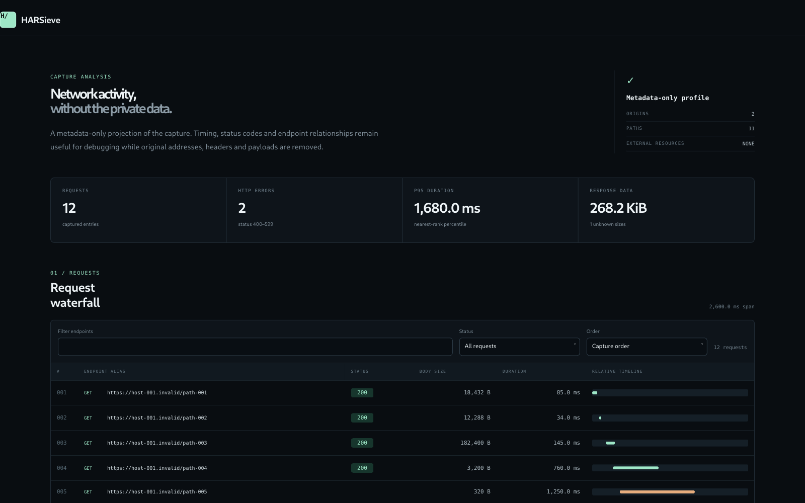

# HARSieve

### Sanitize HAR captures before sharing.

Turn a private HAR capture into a **pseudonymized debugging bundle**. 
Offline CLI · Zero runtime dependencies · Python 3.10+ · MIT

[Try the demo](#try-it-in-30-seconds) · [Privacy contract](docs/privacy.md) · [CLI reference](docs/cli.md) · [Contributing](CONTRIBUTING.md)

A support ticket needs the failing requests, timings and status codes.
It usually does not need your session cookie, response body, customer URL or
internal hostname.

HARSieve rebuilds a metadata-only HAR from a strict allowlist, then adds a
self-contained HTML waterfall and an audit summary. **It never uploads a capture.**

## Try it in 30 seconds

From the extracted project folder or a checkout:

~~~sh
python -m harsieve demo -o demo-bundle
~~~

Open **demo-bundle/report.html**. No package installation or browser server required.
The demo uses fake data and includes two HTTP errors to explore.

To install the CLI from source:

~~~sh
python -m pip install .
harsieve clean capture.har -o share-bundle
~~~

Use python3 if that is your system's Python command. The output directory must
not already exist. HARSieve never edits the input or overwrites an existing bundle.
This project is not yet published on PyPI; install from source or the supplied wheel.

## One command, three artifacts

| File | Purpose |
| --- | --- |
| capture.har | Minimal HAR 1.2 with aliased endpoints and original diagnostic metadata |
| report.html | Searchable waterfall, error filters, slowest-first ordering, p95 and byte totals |
| audit.json | Applied policy, aggregate removal counts and retained-data notice |

The report has no external fonts, scripts, images or API calls. It can be opened
locally, attached to a ticket or viewed without internet access.

~~~sh
# Aggregate JSON without emitting original URLs or strings
harsieve summary capture.har

# CI: create the bundle, then fail if HTTP 400–599 responses were recorded
harsieve clean capture.har -o ci-bundle --fail-on-http-errors
~~~

Exit codes: 0 success, 1 requested HTTP-error gate failed, 2 input/I/O/usage error.
Status 0 means no recorded HTTP response and is reported separately.

## What survives the sieve?

| Removed or replaced | Preserved |
| --- | --- |
| All headers and cookies | HTTP status codes |
| Request and response bodies, including base64 text | Recorded body/header sizes |
| Original hostnames, ports and entire URL paths | Within-capture endpoint equality |
| URL userinfo, query and fragment | Relative start times and durations |
| Page titles, IP addresses, connection IDs, comments | Standard HTTP methods |
| Unknown fields, vendor extensions, WebSocket payloads | Allowlisted MIME categories |
| Absolute dates, creator/browser strings | Known HAR timing phases |

Every original origin becomes a sequential host-001.invalid alias. Every full
path becomes a path-001 alias. Different query values do not split an endpoint.
Mappings are not exported, hashed or reused between captures.

**Pseudonymized is not anonymous.** Timing, sizes, HTTP statuses and traffic shape
remain observable and can identify activity. Review the [privacy contract](docs/privacy.md)
before sharing. HARSieve does not preserve payload-level debugging.

## Why another HAR tool?

Browser exports and existing sanitizers are useful. HARSieve takes a deliberately
narrow approach: **remove all free-form content, preserve the network shape, ship
a readable offline report**. It does not guess whether a parameter name looks
sensitive, run regex secret detection, or promise complete anonymity.

The tradeoff is explicit: fewer original details, less payload-level context.
Use it for latency investigations, HTTP failure sequences and support handoffs.
Keep the original capture locally when investigating headers, caching semantics
or response data.

## Engineering

- Standard library only at runtime; installation build tooling is separate.
- Fresh output projection; unrecognized fields cannot survive by default.
- Bounded input: 64 MiB, 100,000 entries, 64 levels of JSON nesting.
- Duplicate JSON keys and non-finite numbers rejected.
- New output directories only; ordinary write failures clean up partial files.
- 50 tests, including secret canaries, malformed data, alias behavior and CLI I/O.
- Linting and formatting with Ruff; CI covers multiple Python versions and OSes.
- HTML rendering consumes only the sanitized representation.

See [architecture](docs/architecture.md), [verification](docs/verification.md) and
[limitations](docs/privacy.md#limits). This is an initial implementation, not an
independently audited privacy product.

## Development

~~~sh
python -m pip install -r requirements-dev.txt
python -m unittest discover -s tests -v
python -m ruff check .
python -m ruff format --check .
python -m build
~~~

## Roadmap

- Validate import behavior against additional browser HAR producers.
- Add large-capture virtualization to the report.
- Gather real, consented and already-redacted compatibility fixtures.
- Add optional CI latency budgets after defining stable semantics.

No server, telemetry or automatic capture upload is planned.

Built by [DushaneW](https://github.com/DushaneW). Contributions and reproducible,
**synthetic** bug reports welcome. If it helps your team, a star helps others find it.
